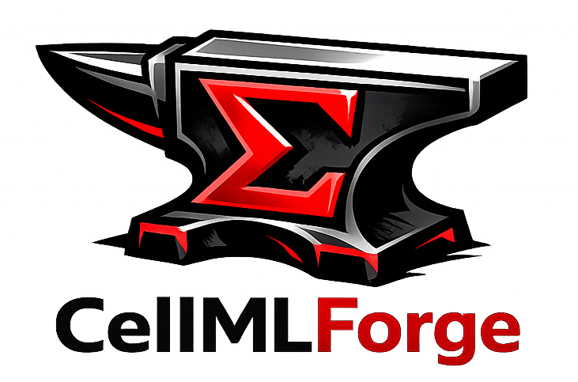

# CellMLForge Workspace Manager

Desktop application for managing OMEX/COMBINE workspaces with local git operations and GitHub integration.



## What it does

- Create and open local OMEX workspaces
- Import files and folders (file picker or drag and drop)
- Auto-detect file changes and suggest commit messages
- Edit manifest entries (format, master file, exclusion)
- Commit changes locally via integrated git workflow
- Build ZIP archives and generate OpenCOR launch URLs
- Authenticate with GitHub and push to selected repositories
- Clone and open GitHub repositories into local workspaces
- Show diagnostics from Help -> About (including copy-to-clipboard)

## Current stack

- Electron main process + preload IPC bridge
- Vue 3 renderer with TypeScript
- PrimeVue component library
- isomorphic-git for git operations
- Octokit for GitHub API calls
- xmlbuilder2 + archiver/jszip services for manifest and archive tasks

## Quick start

### Prerequisites

- Node.js 24 (recommended)
- npm 11 (recommended)

### Install

```bash
npm ci
```

### Run in development

```bash
npm run dev
```

This starts:

1. Vite dev server on port 5173
2. Electron connected to that dev server

### Build TypeScript only

```bash
npm run build-ts
```

## Packaging

### Full package build (current platform)

```bash
npm run dist
```

### Fresh full build (stop app + clean + build)

```bash
npm run dist:fresh
```

### Fast local checks

```bash
npm run dist:dir
npm run dist:quick
```

Notes:

- Icon preparation runs only on Windows via prepare-icons:if-win.
- Linux and macOS builds skip Windows ICO generation.

## How to use the app

### 1. Create or open a workspace

Use File menu:

- File -> New Workspace
- File -> Open Workspace
- File -> New Workspace from GitHub
- File -> Open Workspace from GitHub

### 2. Sign in to GitHub (optional but recommended)

- Click Sign in with GitHub in the top-right account panel.
- Approve the device flow in browser when prompted.
- Use the account menu to review permissions or logout.

### 3. Import files

- Drag files/folders into the app, or
- Use import controls in the workspace UI.
- If name collisions are detected, you will be prompted to overwrite or cancel.

### 4. Review manifest settings

For each workspace file you can:

- Set manifest format/type
- Mark a master file (commonly SED-ML)
- Exclude files from manifest and ZIP packaging

### 5. Commit changes

- Refresh git insights to detect current added/modified/deleted files.
- Accept or edit the suggested commit summary.
- Add optional commit description.
- Commit through the in-app workflow.

### 6. Build ZIP and launch in OpenCOR

- Export ZIP from the workspace view.
- App updates manifest.xml before building archive.
- App can generate a base64 OpenCOR launch URL.
- You can open the URL directly or copy it to clipboard.

### 7. Sync to GitHub

- Use Sync to GitHub when signed in.
- If no repository is linked, choose one from the repository browser.
- Push to your configured branch (default main).

### Help menu

Use Help menu for:

- About dialog with app/runtime diagnostics
- Copy Diagnostics button for issue reports
- View GitHub Repository
- Submit an Issue

## Screenshots

UI screenshots are not yet checked into the repository. Recommended screenshots to add:

1. Main workspace screen after opening a project
2. Manifest editing table with type/master/exclude controls
3. Git commit panel with suggestion + description fields
4. GitHub repository browser modal
5. About dialog showing diagnostics and Copy Diagnostics button

Suggested folder structure:

- docs/screenshots/main-workspace.png
- docs/screenshots/manifest-editor.png
- docs/screenshots/commit-panel.png
- docs/screenshots/repo-browser.png
- docs/screenshots/about-dialog.png

After adding screenshots, embed them in this section using standard markdown image links.

## Release automation

Two workflows handle release prep and artifact publishing.

### Prepare Draft Release workflow

Workflow: .github/workflows/prepare-release.yml

Trigger manually from GitHub Actions with a semver input (for example, 0.1.2 or 0.2.0-beta.1).

It will:

1. Validate semver format
2. Ensure tag/release do not already exist
3. Bump package version
4. Verify lockfile with npm ci
5. Commit package.json and package-lock.json
6. Push branch commit and tag
7. Create a draft release

### Build Release Assets workflow

Workflow: .github/workflows/build-release-assets.yml

Triggered when a release is published.

Build matrix:

- Windows: NSIS installer + portable EXE
- macOS: DMG + ZIP
- Linux: AppImage + tar.gz

Important detail:

- Windows icon prep runs only on windows-latest in CI.

## Project structure

```text
src/
  domain/
    models.ts
  main/
    ipc-handlers.ts
    main.ts
    preload.ts
  renderer/
    App.vue
    main.ts
    index.css
  services/
    workspace.ts
    manifest.ts
    git.ts
    github.ts
    zip.ts

scripts/
  convert-icon.js

.github/workflows/
  prepare-release.yml
  build-release-assets.yml
```

## Troubleshooting

### Build or packaging failures

- Run npm ci to ensure lockfile sync.
- Run npm run build-ts to validate TypeScript output.
- Use npm run dist:fresh for clean local packaging.

### GitHub authentication issues

- Sign out and sign back in from the account menu.
- Use Review permissions in the account menu to validate OAuth access.

### Reporting issues

Use Help -> Submit an Issue in the app, or open:

- https://github.com/nickerso/cellmlforge-workspace-manager/issues/new/choose

Include diagnostics copied from Help -> About -> Copy Diagnostics.

## License

Apache-2.0
